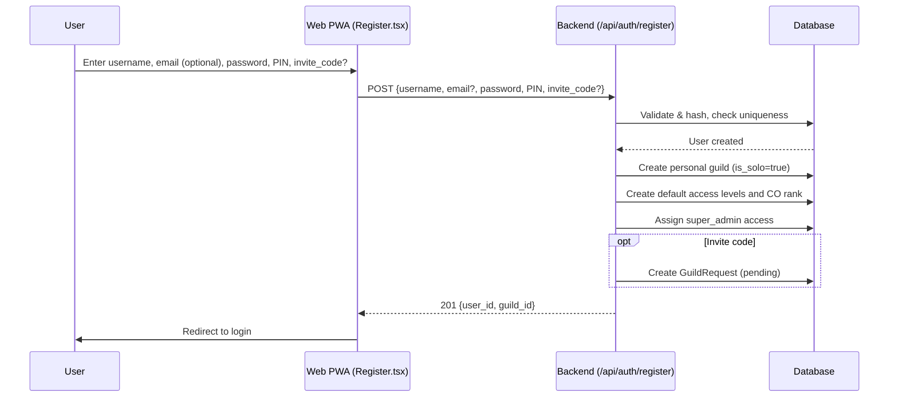
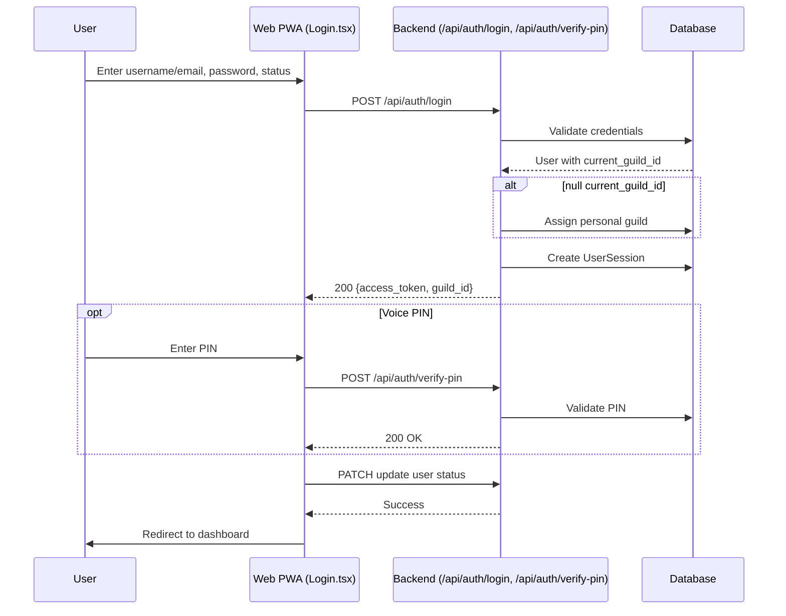
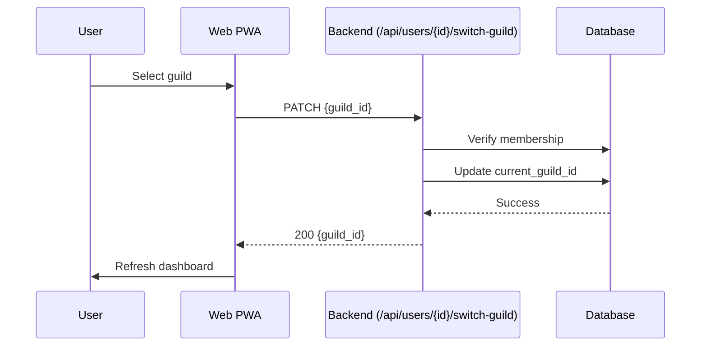
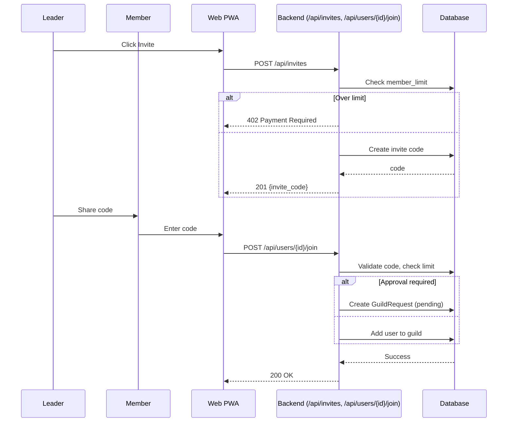
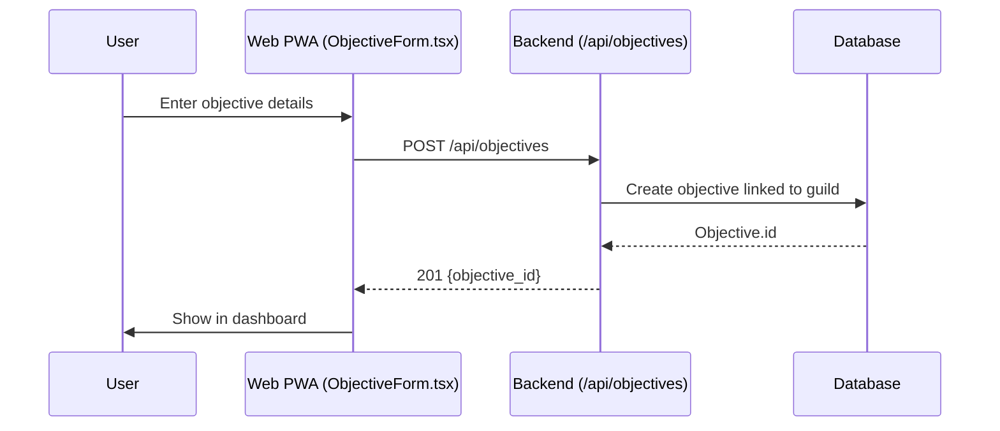
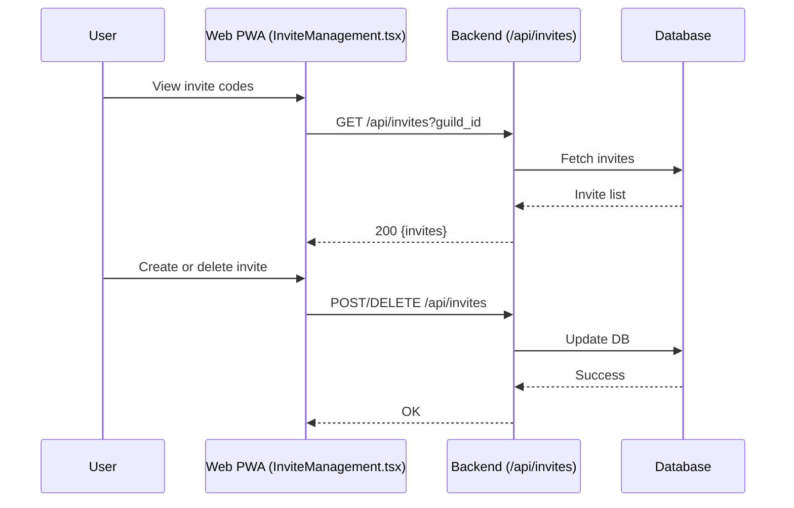
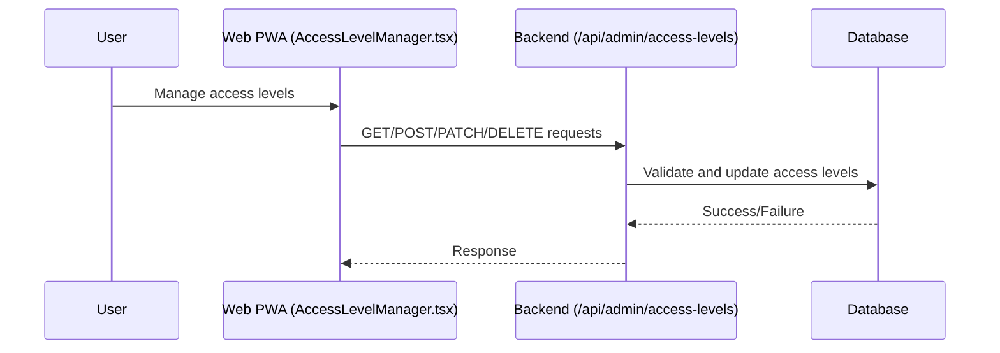

# Sphere Connect – Project Flows

This file describes the **use case flows** of Sphere Connect, with Mermaid diagrams for clarity.

For detailed data entities referenced here, see [`project_data_structures.md`](./project_data_structures.md). For the broader project context, see [`project_context.md`](./project_context.md).

---

## Table of Contents
1. [Registration](#1-registration)
2. [Login](#2-login)
3. [Guild Management](#3-guild-management)
   - [Switch Guild](#switch-guild)
   - [Invite & Join](#invite--join)
   - [Approval / Leave / Kick](#approval--leave--kick)
4. [Objective & Task Management](#4-objective--task-management)
5. [Invite Management](#5-invite-management)
6. [Access Level Management](#6-access-level-management)
7. [Notes](#notes)
8. [Entities Referenced in These Flows](#entities-referenced-in-these-flows)

---

## 1. Registration

---

## 2. Login

---

## 3. Guild Management
### Switch Guild

### Invite & Join

### Approval / Leave / Kick
- **Approval**: Leader approves/rejects pending requests.
- **Leave/Kick**: User leaves or is removed, auto-switch to personal guild.

---

## 4. Objective & Task Management

---

## 5. Invite Management

---

## 6. Access Level Management

---

## Notes
- Voice subset (MVP): guild switching, objective creation, progress reporting.
- Other flows (invite/join/leave/kick) remain web-only until later phases.

---

## Entities Referenced in These Flows
- [Users](./project_data_structures.md#2-users)
- [Guilds](./project_data_structures.md#1-guilds)
- [Invites & Requests](./project_data_structures.md#3-invites--requests)
- [Objectives](./project_data_structures.md#7-objectives)
- [Tasks](./project_data_structures.md#8-tasks)
- [Ranks & Access Levels](./project_data_structures.md#6-ranks--access-levels)

