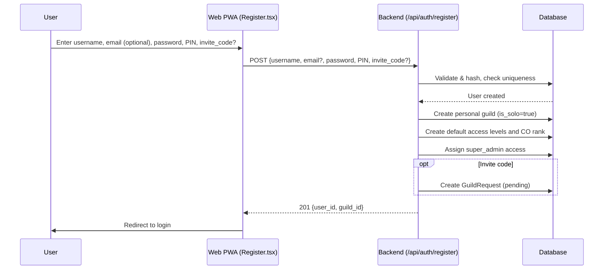
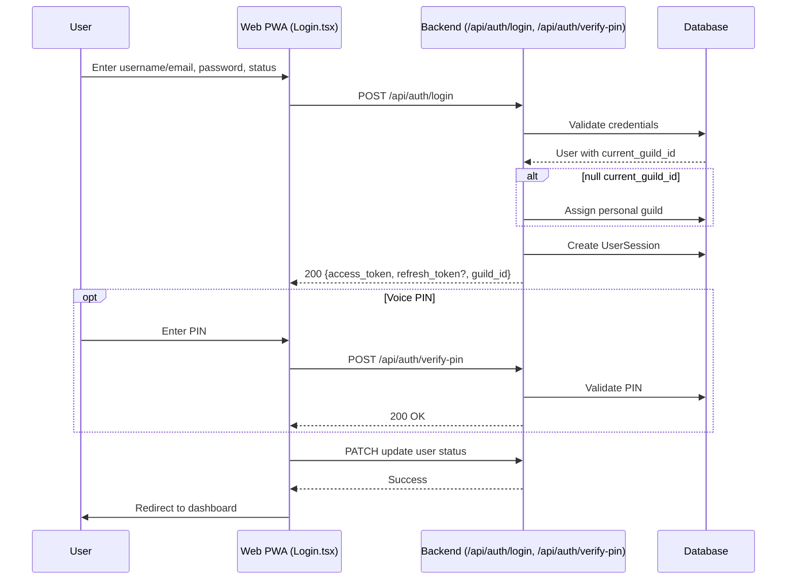
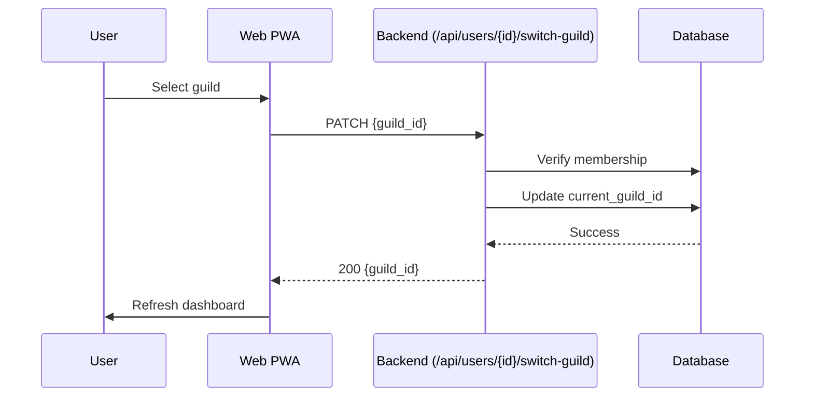
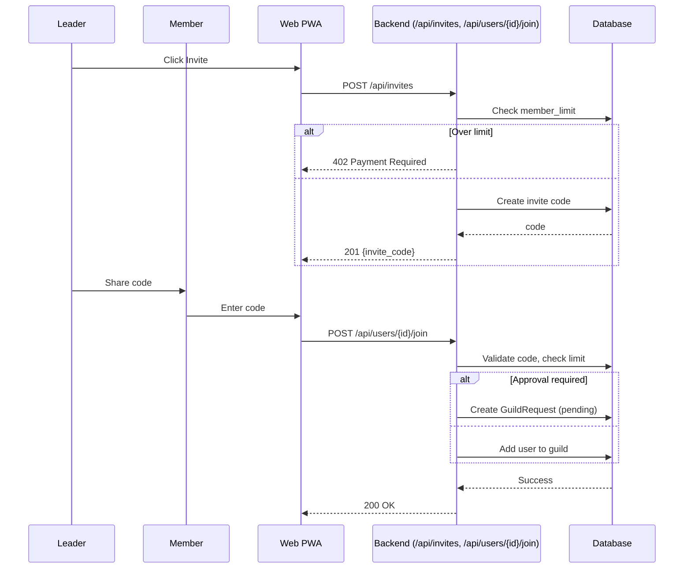
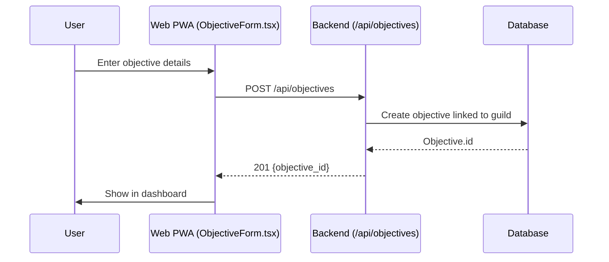
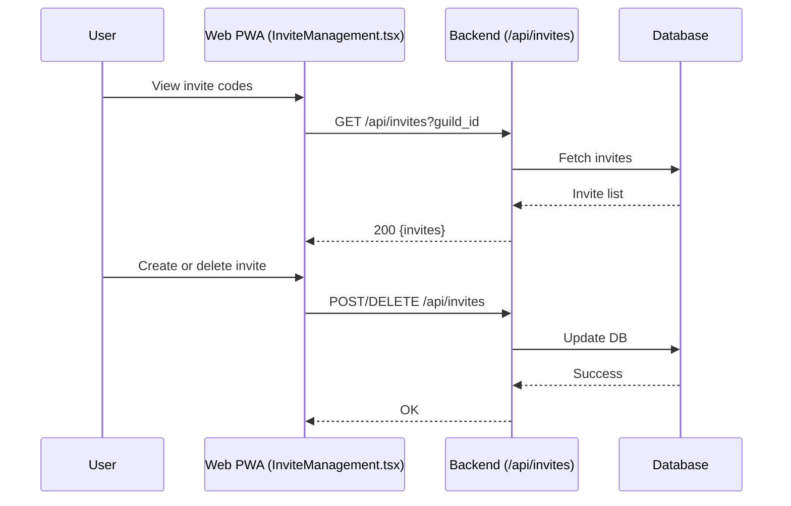
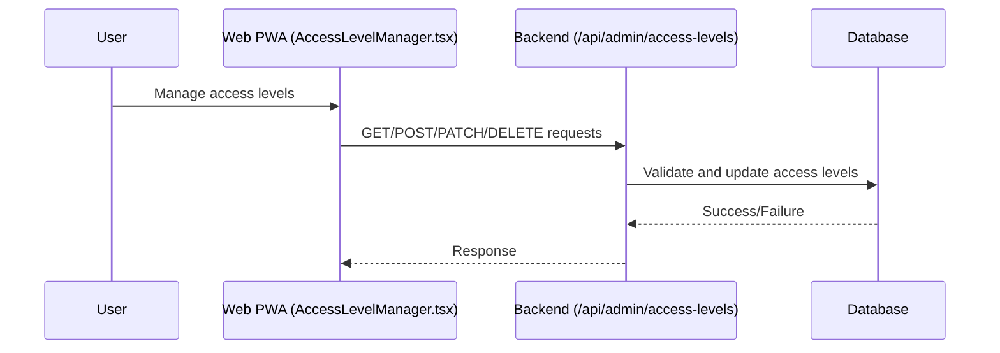
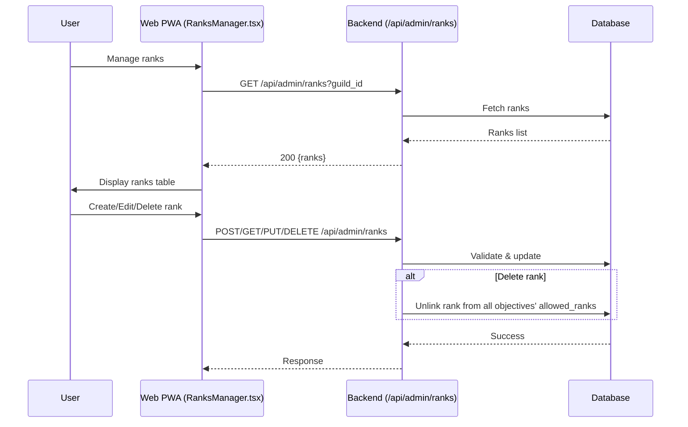
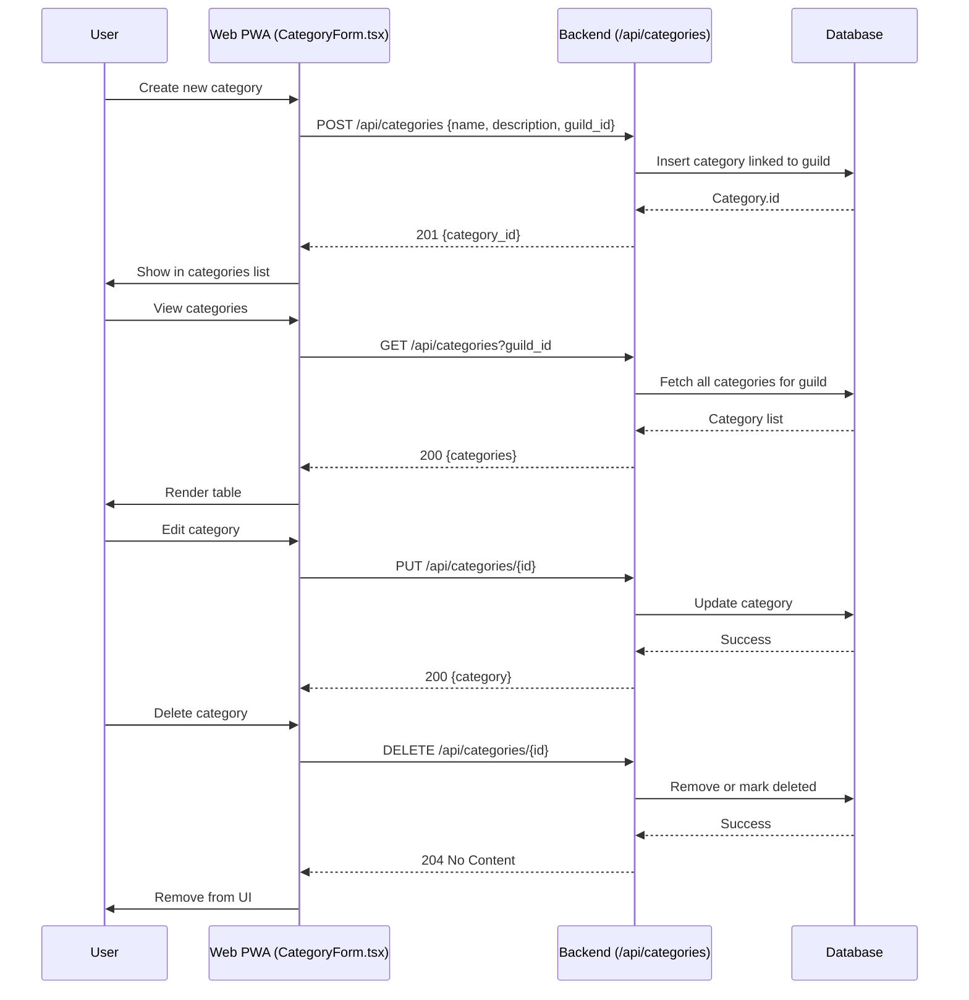

# Sphere Connect – Project Flows

This file describes the **use case flows** of Sphere Connect, with Mermaid diagrams for clarity.

For detailed data entities referenced here, see [`project_data_structures.md`](./project_data_structures.md). For the broader project context, see [`project_context.md`](./project_context.md).

---

## Table of Contents
1. [Registration](#1-registration)
2. [Login](#2-login)
    - [Session & Token Refresh](#session--token-refresh)
3. [Guild Management](#3-guild-management)
   - [Switch Guild](#switch-guild)
   - [Invite & Join](#invite--join)
   - [Approval / Leave / Kick](#approval--leave--kick)
4. [Objective & Task Management](#4-objective--task-management)
5. [Invite Management](#5-invite-management)
6. [Access Level Management](#6-access-level-management)
7. [User Management](#7-user-management)
8. [Rank Management](#8-rank-management)
9. [Category Management](#9-category-management)
10. [Notes](#notes)
11. [Entities Referenced in These Flows](#entities-referenced-in-these-flows)

---

## 1. Registration

---

## 2. Login

### Session & Token Refresh
- All frontend requests use a shared Axios client (`frontend/src/api.ts`).
- If an access token expires, the client:
  1. Receives `401 Unauthorized`
  2. Calls `POST /api/auth/refresh` with the stored `refresh_token`
  3. On success, updates tokens and retries the original request
  4. On failure, clears session and redirects to `/login`
- Error semantics:
  - `401` → expired/invalid token (client should refresh or redirect)
  - `403` → valid token but insufficient permissions

---

## 3. Guild Management
### Switch Guild

### Invite & Join

### Approval / Leave / Kick
- **Approval**: Leader approves/rejects pending requests.
- **Leave/Kick**: User leaves or is removed, auto-switch to personal guild.

---

## 4. Objective & Task Management

**Notes:**
- Objective CRUD now returns categories as IDs; frontend resolves them to names.
- Editing objectives pre-checks assigned categories in the form using IDs.
- Category deletion unlinks categories from objectives without removing objectives.
- Objectives now use `allowed_ranks[]` (array of rank IDs) for visibility.
- `applicable_rank` is deprecated; if provided, it is converted into `allowed_ranks` for backward compatibility.
- UI behavior:
  - When a rank is selected, all ranks with equal or higher seniority (lower hierarchy_level) are auto-selected by default.
  - Example: selecting CO (3) auto-selects XO (2), Commander (1).
  - Users can override by manually unchecking ranks.
- Backend stores only the explicit `allowed_ranks[]` list and enforces visibility strictly by membership.
- Super_admin bypass applies regardless of `allowed_ranks`.

---

## 5. Invite Management

---

## 6. Access Level Management

---

## 7. User Management
- **Identity self-service**: `/api/auth/register` handles creation, and `/api/users/{id}` (future profile page) will let members update username/email/password/PIN. Admin APIs never mutate these fields.
- **Admin overview**: `/api/admin/users?guild_id=` returns approved members with read-only identity details plus guild-state attributes (rank, squad, access levels) and the member’s selected preferences.
- **Filtering**: `preference_ids[]` query params allow guild staff to narrow the list by global preferences (combat, exploration, logistics, trade, industry, etc.) without editing selections.
- **Guild-state updates**: `PATCH /api/admin/users/{id}` accepts `rank_id`, `squad_id`, and `access_level_ids`. Empty strings remove assignments. Super admins retain bypass rights.
- **Preferences**: `/api/preferences` exposes the catalog. Users manage their selections via `/api/users/{id}/preferences` (GET/PUT). Admin tooling displays preferences read-only but uses the catalog for filtering.
- **Frontend UX** (`UsersManager.tsx`): shows identity read-only, inline selects for rank/squad, checkbox list for access levels, and chip-based preference filters. Messages use `AdminMessage`.

---

## 8. Rank Management

**Notes:**
- Rank hierarchy uses `hierarchy_level` (lower number = higher rank).
- Rank deletion automatically unlinks the rank from all objectives' `allowed_ranks`.
- If `allowed_ranks` becomes empty after deletion, objectives become visible only to super_admin.
- Super_admin rank cannot be deleted or modified.

## 9. Category Management

**Notes:**  
- All routes are **guild-scoped** (`guild_id` required).  
- Access control enforced via new user functions:  
  - `view_categories`  
  - `create_category`  
  - `manage_categories`  
- `super_admin` bypass applies automatically.  
- Categories can be filtered by name/description.
- Objectives filter by `category_id`.
- Deleting a category only unlinks it from objectives.

---

## 10. Notes
- Voice subset (MVP): guild switching, objective creation, progress reporting.
- Other flows (invite/join/leave/kick) remain web-only until later phases.

---

## 11. Entities Referenced in These Flows
- [Users](./project_data_structures.md#2-users)
- [Guilds](./project_data_structures.md#1-guilds)
- [Invites & Requests](./project_data_structures.md#3-invites--requests)
- [Objectives](./project_data_structures.md#7-objectives)
- [Tasks](./project_data_structures.md#8-tasks)
- [Ranks & Access Levels](./project_data_structures.md#6-ranks--access-levels)

